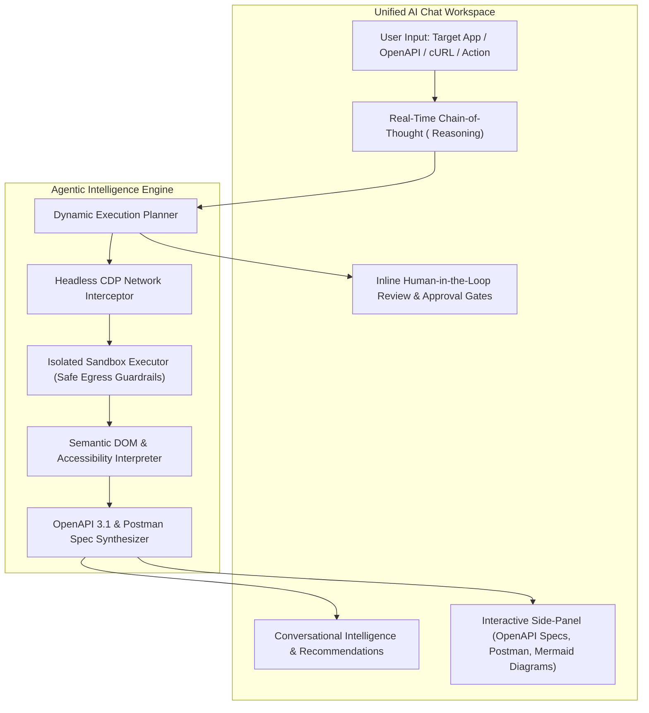

# Agentic Crawl & Autonomous Exploration — Concept, Problem Statement & Redesign Blueprint

> **Status**: Concept Preserved for Redesign  
> **Target Integration**: Unified Conversational Agentic Intelligence Engine  
> **Document Version**: 2.0.0

---

## 1. Executive Summary & Problem Statement

### 1.1 The Core Problem
Modern web applications are increasingly dynamic single-page applications (SPAs) built with React, Vue, Angular, Svelte, or Next.js. Most web platforms lack comprehensive, up-to-date OpenAPI/Swagger specifications for their internal and external APIs. Engineering, security, and QA teams constantly face significant friction when trying to:
1. **Discover Undocumented Endpoints**: Understanding all REST, GraphQL, and WebSocket endpoints invoked during user interactions.
2. **Reverse Engineer Schema Structures**: Inferring complex nested JSON request/response payloads, query parameters, path variables (e.g. `/users/{id}` vs `/users/101`), and header requirements.
3. **Capture Authentication Flows**: Tracing OAuth2 tokens, session cookies, CSRF tokens, and API keys across authentication states.
4. **Prevent Regression & Drift**: Identifying breaking API schema drift between releases without writing manual integration tests for hundreds of endpoints.

### 1.2 The Initial Agentic Crawl Concept
The initial version of InsightAPI AI attempted to solve this by creating an autonomous browser crawler using Playwright and multi-agent LangGraph loops (Planner, Explorer, Analyzer, and Security Reasoner nodes) that navigated web applications in a detached batch processing mode.

---

## 2. Limitations & Shortcomings of the Initial Architecture

While conceptually powerful, the decoupled batch crawler had several architectural and operational pain points:

| Limitation Area | Root Cause in V1 Implementation | Impact on User Experience |
| :--- | :--- | :--- |
| **User Workflow Disconnection** | The crawl was initiated in separate modals/drawers (`CrawlSettingsModal`, `CrawlActivityDrawer`, `SchemaReviewModal`), isolating exploration from the primary chat intelligence thread. | High friction; users had to navigate across multiple views instead of interacting naturally with an intelligent AI assistant. |
| **DOM Tree Distillation Overhead** | Distilling 100k+ token HTML pages into AXTree representations introduced latency and occasional token truncation during rapid UI transitions. | Slower exploration cycles and high token consumption per navigation step. |
| **State-Space Explosion in SPAs** | Infinite scrolling containers, dynamic modals, and calendar pickers generated cyclic or redundant state hashes, leading to over-crawling. | Unnecessary request volume and prolonged execution times. |
| **Destructive Action Hazards** | Relying on regex-based Two-Tier Risk Classifiers required careful guardrails to prevent inadvertent clicks on destructive actions (e.g. "Delete Project", "Cancel Account"). | Risk of unintentional data modifications if target sites lacked testing environments. |
| **Asynchronous Task Synchronization** | Managing Celery crawl worker queues, Redis PubSub streams, and WebSocket proxies across 3 microservices created distributed state complexity. | Flaky stream reconnections and debugging overhead. |

---

## 3. The Redesigned Vision: Unified In-Chat Agentic Exploration

Rather than treating autonomous crawling as a separate, detached batch pipeline, the **redesigned architecture embeds exploration directly into the conversational Agentic Chat workspace** (similar to ChatGPT, Claude Artifacts, and Antigravity IDE).

---

## 4. Key Architectural Pillars for the Next Generation

### 4.1 Single-Pane-of-Glass Conversational Workflow
* **No Disjointed Pages**: All reasoning steps, schema verifications, test generation, and approvals happen directly inside the chat stream.
* **Real-Time Step Visibility**: Live `<think>` chain-of-thought blocks display exploration intent, endpoint capture statistics, and security reasoning in real time.
* **Instant Artifact Projection**: Discovered OpenAPI schemas, Mermaid architecture flows, and Postman collections render side-by-side in the interactive `<ArtifactPanel />`.

### 4.2 Deterministic + AI Hybrid Exploration
* **Deterministic Baseline**: Use lightweight Chrome DevTools Protocol (CDP) network interception to capture 100% of network traffic passively as users or scripts interact.
* **Goal-Conditioned AI Agent**: Trigger LLM vision/DOM actions only when explicit dynamic exploration (e.g., "Find the checkout payment API") is requested.
* **Zero-Token Cache Replay**: Cache known endpoint route signatures and schemas to avoid redundant LLM calls across recurring sessions.

### 4.3 Active Human-in-the-Loop Verification
* Destructive actions or schema ambiguities (e.g., parameter type conflicts) generate interactive inline approval cards inside the chat bubble.
* Users can approve, modify parameter templates (e.g., change `{id}` to `uuid`), or reject proposed actions with a single click.

---

## 5. Summary & Next Steps
By archiving the decoupled V1 crawl tasks and consolidating the platform into an interactive, streaming AI Chat experience, InsightAPI delivers instant value with zero operational friction while maintaining a clean architectural foundation for this redesigned exploration engine.
