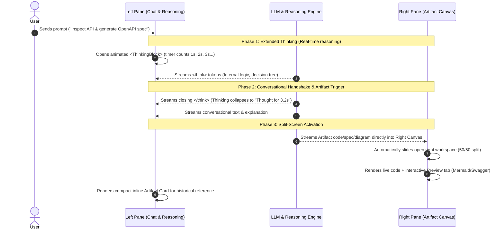

## The Claude.ai Streaming Architecture: Exact Mental Model

Claude.ai transforms from a traditional chatbot into a **collaborative workspace** by dividing the screen into two distinct layers:
1. **Left Pane (The Process Layer)**: The *“How & Why”* — Conversational text, reasoning thoughts, and context.
2. **Right Pane (The Delivery Layer)**: The *“What”* — Interactive artifacts, code, diagrams, and live previews.

---

### 1. Visual Layout & Screen Division

```
┌───────────────────────────────────────────────┬───────────────────────────────────────────────┐
│              LEFT PANE (50% - 60%)            │             RIGHT PANE (40% - 50%)            │
│            PROCESS & REASONING LAYER          │             DELIVERY & WORKSPACE LAYER        │
├───────────────────────────────────────────────┼───────────────────────────────────────────────┤
│                                               │  [Tab: Preview]  [Tab: Code]  [Copy] [Expand] │
│  🧑 User:                                     │ ┌───────────────────────────────────────────┐ │
│  "Generate OpenAPI spec & architecture flow"  │ │  openapi: 3.1.0                           │ │
│                                               │ │  info:                                    │ │
│  🤖 Assistant:                                │ │    title: InsightAPI Gateway              │ │
│  ┌──────────────────────────────────────────┐ │ │    version: 1.0.0                         │ │
│  │ ✳️ Thinking... (3.4s)                   ▼│ │ │  paths:                                   │ │
│  │  1. Analyzing target endpoints...        │ │ │    /v1/auth/login:                        │ │
│  │  2. Inferring Bearer token auth flow...  │ │ │      post: ...                            │ │
│  │  3. Formulating Mermaid sequence diag... │ │ └───────────────────────────────────────────┘ │
│  └──────────────────────────────────────────┘ │                                               │
│                                               │  ┌─── Interactive Live Preview ─────────────┐ │
│  Here is the inferred OpenAPI specification   │  │  [Client] ──> [Gateway] ──> [Database]    │ │
│  and the sequence diagram for your pipeline:  │  │  (Theme-aware rendered Mermaid diagram)  │ │
│                                               │  └──────────────────────────────────────────┘ │
│  ┌─── Artifact Card (Inline Reference) ─────┐ │                                               │
│  │ 📦 OpenAPI 3.1 Specification             │ │                                               │
│  │ Click to open in workspace pane →        │ │                                               │
│  └──────────────────────────────────────────┘ │                                               │
│                                               │                                               │
│  [ Bottom Prompt Input: Ask for changes... ]  │  [ Actions: Download .yaml | Export Newman ]  │
└───────────────────────────────────────────────┴───────────────────────────────────────────────┘
```

---

### 2. The 3-Phase Streaming Lifecycle



---

### 3. Exact Mental Model: What Displays Where

| Area | What Displays | Why It Belongs There |
| :--- | :--- | :--- |
| **Left Pane: Top** | Collapsible `<ReasoningBlock />` (`Thinking... (4s)`) | Shows the LLM's step-by-step internal deductions without pushing the main response down permanently. |
| **Left Pane: Middle** | Conversational Explanations & Markdown | High-level synthesis, guidance, prerequisites, and callout alerts. |
| **Left Pane: Inline Card** | Interactive Artifact Badge (`📦 OpenAPI Spec`) | Anchors the deliverable to this exact message in history so clicking it re-opens that version. |
| **Left Pane: Bottom** | Prompt Input Box | Always accessible so the user can iterate (`"Add a rate limit parameter to /v1/users"`). |
| **Right Pane: Header** | `[Preview]` / `[Code]` Tabs + `[Copy]` + `[Download]` + `[Expand]` | Gives immediate control to switch between visual rendering and raw code. |
| **Right Pane: Body** | Full syntax-highlighted editor or interactive diagram canvas | Keeps 300+ lines of raw code or complex diagrams from cluttering and breaking the chat scroll. |

---

### 4. Why This Eliminates User Friction

1. **Zero Context Loss**: 
   In standard chatbots, a 400-line code block forces the user to scroll endlessly to find the explanation. With side-by-side artifacts, the explanation stays readable on the left while the code lives on the right.
2. **Real-Time Visual Validation**: 
   While the left side is explaining authentication flows, the right side renders the live Mermaid diagram or OpenAPI Swagger documentation interactively.
3. **Seamless Iterative Refinement**:
   The user views the artifact on the right and types `"Make the timeout 10 seconds"` on the left. The reasoning stream explains what changed, and the right panel updates the code live.