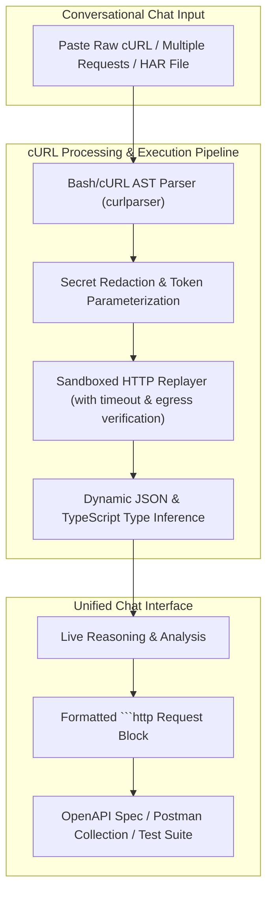

# cURL Template & Request Import — Concept, Problem Statement & Redesign Blueprint

> **Status**: Concept Preserved for Redesign  
> **Target Integration**: Unified Conversational Agentic Intelligence Engine  
> **Document Version**: 2.0.0

---

## 1. Executive Summary & Problem Statement

### 1.1 The Core Problem
When developers, QA engineers, and security analysts debug APIs or build new integrations, the most ubiquitous interoperability format is the `cURL` command. Teams frequently use **"Copy as cURL"** from browser DevTools, Postman, terminal history, or internal runbooks.

However, transforming raw cURL commands into production-grade artifacts presents major friction:
1. **Manual Schema Reconstruction**: Converting raw `-d '{"user_id": 123, "active": true}'` JSON payloads into formal OpenAPI 3.1 schema definitions with types and validation rules.
2. **Hidden Authentication & Sensitive Tokens**: Extracting Bearer tokens, API keys (`X-API-Key`), session cookies, and basic auth headers without accidentally leaking secrets into static docs.
3. **Parameter Parameterization**: Identifying hardcoded IDs (`https://api.example.com/v1/orders/ord_898492842/items`) and converting them into template routes (`/orders/{order_id}/items`).
4. **Interactive Sandbox Replay**: Safely sending, replaying, and fuzzing requests in an isolated runtime environment to observe actual HTTP response headers, status codes, and error bodies.

### 1.2 Limitations of the Initial "Insert cURL Template" Feature
In V1, the feature was a simplistic UI dropdown menu item (`Insert cURL Template`) in `prompt-input.tsx` that merely pasted a hardcoded static string into the text area. It lacked:
- Syntactic Bash AST parsing for multi-line cURL arguments (`\`, `-H`, `--data-raw`, `--compressed`).
- Automatic response capture and dynamic JSON Schema generation.
- Batch processing for HAR files or multiple interrelated requests.
- Conversational interaction for parameter modification.

---

## 2. The Redesigned In-Chat cURL Intelligence Architecture

In the unified chat workspace, cURL ingestion operates as a native multimodal input directly inside the conversational stream:

---

## 3. Key Redesign Capabilities

### 3.1 Resilient Bash & cURL AST Parsing
The redesigned engine will parse any standard cURL flavor:
- Standard Unix/Linux bash escapes (`\` line breaks).
- PowerShell cURL aliases and Windows CMD formatting.
- Complex flag variations (`-X`, `--request`, `-H`, `--header`, `-d`, `--data`, `--data-raw`, `--data-binary`, `-F`, `--form`, `-u`, `--user`, `-b`, `--cookie`).

### 3.2 Automated Schema & Endpoint Extraction
* When a user pastes one or more cURL snippets into chat, the assistant automatically parses the HTTP method, host, path, query parameters, headers, and request body.
* Path parameters are automatically suggested (e.g. normalizing `https://api.acme.com/v2/invoices/inv_9981` to `/invoices/{invoice_id}`).

### 3.3 Dynamic Sandboxed Replay & Response Modeling
* If requested by the user, the sandbox replayer safely executes the request against authorized domains.
* Live responses (headers, status code, JSON response body) are analyzed to generate exact JSON schema definitions with type validation, required fields, and example values.

### 3.4 One-Click Export to Code & Documentation
Directly in the `<ArtifactPanel />`, users receive:
1. **OpenAPI 3.1 Specification** (YAML/JSON).
2. **Postman Collection v2.1** with environment variables for base URLs and auth tokens.
3. **Integration Code Snippets** in Python (`httpx` / `requests`), TypeScript (`fetch` / `axios`), Go, and Rust.
4. **Playwright / Newman Automation Tests** for CI/CD pipeline verification.

---

## 4. Conclusion
Replacing the superficial static cURL template with a full conversational cURL intelligence pipeline allows developers to paste any real-world request directly into chat and instantly receive formatted HTTP blocks, deep analysis, and complete API specifications.
