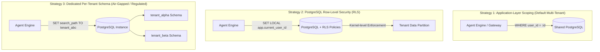

# InsightAPI Enterprise Architecture & Deployment Guide

> **Enterprise Hardened Deployment Guide**: Dedicated VPC, On-Premises Docker Compose orchestration, Customer-Managed Databases, and Multi-Tenant Isolation Architectures.

---

## 1. Multi-Tenant Data Isolation Architectures

InsightAPI supports three tiers of data isolation depending on enterprise security and compliance requirements:



### Comparison Matrix

| Isolation Strategy | Security Level | Operational Overhead | Migration Complexity | Best For |
| :--- | :--- | :--- | :--- | :--- |
| **App-Layer Scoping** | High | Low | None | SaaS Multi-Tenant Cloud |
| **Row-Level Security (RLS)** | Very High (Kernel-level) | Low-Medium | Unified Migration | Enterprise Multi-Tenant SaaS |
| **Dedicated Schemas** | Ultra High (Namespace-level) | Medium | Per-tenant DDL | Regulated FinTech / Healthcare |
| **Dedicated VPC / On-Prem** | Maximum (Physical/Network) | High (Customer-Managed) | Independent Infra | Air-Gapped / GovCloud / VPC |

---

## 2. PostgreSQL Row-Level Security (RLS) Setup

Apply [`deploy/rls_and_isolation.sql`](file:///c:/Users/ashut/Devlopments/InsightAPI/deploy/rls_and_isolation.sql) to enforce database-level tenant gating on `crawl_sessions`, `crawl_snapshots`, `auth_profiles`, `verified_domains`, and `audit_logs`:

```sql
-- Enable RLS
ALTER TABLE crawl_sessions ENABLE ROW LEVEL SECURITY;

-- Apply Tenant Policy
CREATE POLICY tenant_isolation_crawl_sessions ON crawl_sessions
    FOR ALL
    USING (
        user_id = NULLIF(current_setting('app.current_user_id', true), '')
        OR current_setting('app.current_user_tier', true) = 'ADMIN'
    );
```

Before each transaction in the session pool:
```python
await db.execute(text(f"SET LOCAL app.current_user_id = '{user_id}';"))
```

---

## 3. Dedicated Customer VPC / On-Premises Deployment

For customers unwilling to send crawl data to shared infrastructure, use `docker-compose.enterprise.yml`.

### Environment Configuration (`.env.enterprise`)

```bash
# ── Customer-Managed External PostgreSQL (e.g. AWS RDS / Google Cloud SQL) ──
EXTERNAL_POSTGRES_HOST=postgres.internal.mycorp.com
EXTERNAL_POSTGRES_PORT=5432
EXTERNAL_POSTGRES_USER=insightapi_admin
EXTERNAL_POSTGRES_PASSWORD=StrongCustomerSecretPassword123!
EXTERNAL_POSTGRES_DB=insightapi_prod

# ── Customer-Managed External Redis (e.g. AWS ElastiCache / Redis Cluster) ──
EXTERNAL_REDIS_HOST=redis.internal.mycorp.com
EXTERNAL_REDIS_PORT=6379
EXTERNAL_REDIS_PASSWORD=CustomerRedisSecretToken456!

# ── Private/Local LLM Endpoint (Optional Air-Gapped Inference) ─────────────
ENTERPRISE_LLM_BASE_URL=http://vllm-service.internal.mycorp.com:8000/v1
ENTERPRISE_LLM_API_KEY=internal-vllm-key
```

### Launching the Stack

```bash
docker compose -f docker-compose.enterprise.yml --env-file .env.enterprise up -d --build
```

---

## 4. Enterprise Compliance Audit Logging

InsightAPI logs all critical lifecycle and security actions into the `audit_logs` table:

- `crawl.create` / `crawl.delete`
- `export.download` (OpenAPI, Postman, Markdown, Playwright scripts, CI/CD zips)
- `auth_profile.create` / `auth_profile.update` / `auth_profile.delete` / `auth_profile.test`
- `drift_webhook.trigger`

### Accessing Audit Logs API

**Endpoint**: `GET /api/v1/audit-logs` (Gated to `ENTERPRISE` tier / `ADMIN` role)

```http
GET /api/v1/audit-logs?action=export.download&limit=50 HTTP/1.1
Host: insightapi.mycorp.com
X-User-Id: usr_enterprise_corp
X-User-Tier: ENTERPRISE
```

**Response**:
```json
{
  "items": [
    {
      "id": "2b6bca38-51f7-4187-b5bb-3430034a7428",
      "user_id": "usr_enterprise_corp",
      "project_id": "default",
      "action": "export.download",
      "target_id": "session-1029",
      "ip": "10.0.4.12",
      "timestamp": "2026-08-14T23:58:42.102Z",
      "metadata": {
        "format": "playwright_python",
        "as_zip": true
      }
    }
  ],
  "total": 1,
  "limit": 50,
  "offset": 0
}
```
